<h1>CodeAcademy HTML/CSS/JS 1 lygio konspektas</h1>

- [HTML](#html)
  - [Kas yra HTML?](#kas-yra-html)
  - [HTML sintaksė](#html-sintaksė)
    - [Atributai](#atributai)
    - [Savaime užsidarančios žymės (angl. *self-closing tags*)](#savaime-užsidarančios-žymės-angl-self-closing-tags)
  - [Paprastų žymių sąrašas](#paprastų-žymių-sąrašas)
  - [HTML karkasas](#html-karkasas)
  - [HTML lentelės](#html-lentelės)
    - [Žymės](#žymės)
    - [Lentelės kraštinės](#lentelės-kraštinės)
    - [*border-collapse*](#border-collapse)
    - [Langelių sujungimas](#langelių-sujungimas)
  - [HTML formos](#html-formos)
- [CSS](#css)
  - [Apie CSS](#apie-css)
  - [CSS sintaksė](#css-sintaksė)
  - [CSS selektoriai](#css-selektoriai)
  - [Paprasti CSS atributai](#paprasti-css-atributai)
  - [Sudėtingesni CSS selektoriai, naudojant kombinatorius](#sudėtingesni-css-selektoriai-naudojant-kombinatorius)
  - [CSS pseudoklasės (*pseudo-classes*)](#css-pseudoklasės-pseudo-classes)
  - [Flexbox](#flexbox)
  - [Grid](#grid)
  - [Prisitaikantys puslapiai (*responsive websites*) naudojant @media](#prisitaikantys-puslapiai-responsive-websites-naudojant-media)
  - ["Mobile-first" dizainas](#mobile-first-dizainas)
  - [CSS karkasai (*frameworks*)](#css-karkasai-frameworks)
  - [CSS preprocesoriai (*preprocessors*)](#css-preprocesoriai-preprocessors)
  - [Git + Github](#git--github)
- [Atsakymai į praktikos užduotis](#atsakymai-į-praktikos-užduotis)
  - [Sudėtingesni CSS selektoriai](#sudėtingesni-css-selektoriai)

# HTML

## Kas yra HTML?
HTML (HyperText Markup Language) yra pats pagrindinis žiniatinklio kūrimo elementas. Jis apibrėžia interneto turinio prasmę ir struktūrą. Kitos technologijos, išskyrus HTML, paprastai naudojamos aprašyti tinklalapio išvaizdą / pristatymą (CSS) arba funkcionalumą / elgesį (JavaScript).

HTML nėra programavimo kalba, tai žymėjimo kalba (angl. markup language), apibrėžianti jūsų turinio struktūrą.

## HTML sintaksė
```html
<tag>Elemento turinys</tag>
```

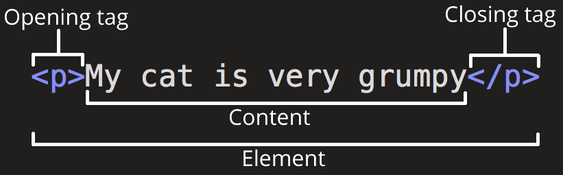

* Tag - žymė
* Opening tag - atidaromoji žymė
* Closing tag - uždaromoji žymė
* Content - turinys
* Element - elementas

Pvz.:

```html
<h1>Apie mus</h1>
```
```html
<p>Manome, jog technologinis išsilavinimas privalo sekti šiandienos ir rytojaus darbo rinkos tendencijas bei būti prieinamas kiekvienam. 🙌 Šiuo principu vadovaudamiesi, kas dieną savo studentams atveriame naujas galimybes. 🔝</p>
```

Turinys gali būti kitas HTML elementas. Pvz.:
```html
<body>
  <p>...</p>
</body>
```

```html
<p>Ši pastraipa turi <strong>paryškinto teksto</strong></p>
```

### Atributai

HTML žymės gali turėti atributus. Atributais aprašoma informacija, kuri nustato arba pakeičia elemento funkcionalumą, bet nėra tiesiogiai rodomi puslapyje.

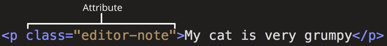

Šiuo atveju `<p>` (pastraipos) elementas turi atributą `class` su reikšmė `editor-note`.

Atributų sintaksė:

```html
<tag atributas="reikšmė"> </tag>
```

Atributų tvarka reikšmės neturi.

Atributai rašomi tik atidaromojoje žymėje.

Atributų reikšmės gali būti rašomos ir tarp viengubų kabučių (' '), tačiau geriausia naudoti tik vieno tipo kabutes, o ne maišyti abiejų.

Pvz.:

```html

```

### Savaime užsidarančios žymės (angl. *self-closing tags*)

Kaip buvo paminėta apie `` žymę, yra tam tikri elementai, kurie neturi uždaromosios žymės, nes niekada neturi vidinio turinio.

Šios žymės kartais rašomos su pasviruoju brūkšniu prieš `>` ženklą, štai taip:

```html
<tag />
```

Taip akivaizdžiau, kada žymė yra savaime užsidaranti ir neturi turinio. Šį brūkšnį galima rašyti tik tada, kai žymė yra savaime užsidaranti (pvz., `<p /> </p>` būtų neteisinga).

Keli pavyzdžiai:

- `<br />`
- `<hr />`
- ``
- `<input />`
- `<link />`
- `<meta />`
- `<source />`

Pilnas (ne kiek didesnis) sąrašas: [http://xahlee.info/js/html5_non-closing_tag.html](http://xahlee.info/js/html5_non-closing_tag.html)

## Paprastų žymių sąrašas

* `<h1>`-`<h6>` - antraštė (1-6 lygio)

  Antraštės turi eiti iš eilės, t.y. jei yra 1-o lygio antraštė ir norima įtraukti mažesnio lygio antraštę, reikia naudoti 2-o lygio antraštę. Pvz.:
  ```html
  <h1>Jūriniai paukščiai</h1>

  <h2>1. Identifikacija</h2>

  <h2>2. Bendroji charakteristika</h2>

  <h3>2.1. Adaptacija prie jūrinės aplinkos</h3>

  <h3>2.2. Mityba</h3>

  <h4>2.2.1. Maisto rinkimas nuo paviršiaus</h4>

  <h4>2.2.2. Povandeninė medžioklė</h4>

  <h2>3. Santykiai su žmogumi</h4>
  ```

  Rezultatas:

  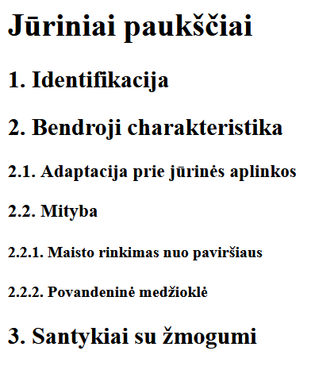

* `<p>` - pastraipa

  Vienas iš paprasčiausių elementų, viduje parašytas tekstas bus formatuojamas kaip paprasta pastraipa.

* `` - nuotrauka

  Reikalingi atributai:
  
  * `src` - nuoroda į nuotrauką
  * `alt` - nuotraukos aprašymas ekrano skaityklėms ar kai nuotrauka neprieinama

  Pvz.:
  ```html
  
  ```

  `` neturi uždaromosios žymės.

* `<a>` - nuoroda

  Reikalingi atributai:
  
  * `href` - nuoroda, kuri bus atidaryta paspaudus ant teksto

  `<a>` žymės turinys yra nuorodos tekstas.

  Pvz.:

  ```html
  <a href="https://www.google.com/">Google</a>
  ```

  Rezultatas: [Google](https://www.google.com/)

* `<strong>` - paryškintas tekstas
* `<em>` - kursyvas
* `<u>` - pabrauktas tekstas
* `<div>`, `<span>` - semantinės reikšmės neturintys elementai, skirti pagrinde CSS apipavidalinimui pritaikyti, atitinkamai bloko ir įterptiniai elementai.
* `<br>` - eilutės lūžis
* `<hr>` - horizontalus brūkšnys

## HTML karkasas

```html
<!DOCTYPE html>
<html lang="lt">
<head>
  <meta charset="UTF-8">
  <meta name="viewport" content="width=device-width, initial-scale=1.0">
  <title>Document</title>
</head>
<body>
  <!-- Turinys -->
</body>
</html>
```

* `<!DOCTYPE html>` - preambulė naršyklėms, nurodanti HTML 5-tą versiją.
 
  Papildoma informacija (anglų k.):

    - [Doctype](https://developer.mozilla.org/en-US/docs/Glossary/Doctype)
    - [Quirks Mode and Standards Mode](https://developer.mozilla.org/en-US/docs/Web/HTML/Quirks_Mode_and_Standards_Mode)

* `<html>` - elementas, apimantis visą HTML turinį.
  
  * `lang` atributas nurodo puslapio turinio kalbą.

* `<head>` - elementas, kuriame dedami metainformacijos (informacijos apie patį puslapį) elementai.
* `<meta charset="utf-8">` - nustato simbolių koduotę į UTF-8
  
  Papildoma informacija: [Kas yra Unikodas?](https://www.unicode.org/standard/translations/lithuanian.html)
* `<meta name="viewport" content="width=device-width, initial-scale=1.0">` - nustato tinkamą ekrano dydis mažiems ekranams
  
  Papildoma informacija (anglų k.): [Viewport \<meta\> tag](https://developer.mozilla.org/en-US/docs/Web/HTML/Viewport_meta_tag)
* `<title>` - nustato puslapio (skirtuko) pavadinimą.
* `<body>` - elementas, kuriame yra visas matomas puslapio turinys.

## HTML lentelės

### Žymės

* `<table>` - apima visą lentelės turinį
* `<thead>` - lentelės stulpelių pavadinimų sritis
* `<tbody>` - lentelės duomenų sritis
* `<tfoot>` - suvestinių (pvz. sumo) sritis
* `<th>` - lentelės stulpelio pavadinimas
* `<tr>` - lentelės eilutė
* `<td>` - lentelės langelis
* `<caption>` - lentelės pavadinimas
* `<colgroup>` - lentelės stulpelių aprašymas (skirta paprastensiam CSS apipavidalinimui)
* `<col>` - lentelės stulpelio aprašymas, rašomas `<colgroup>` elemente

Pavyzdinė lentelės struktūra:

```html
<table>
  <thead>
    <tr>
      <th>Vardas</th>
      <th>Pavardė</th>
      <th>Gimimo data</th>
      <th>Gyvenamoji vieta</th>
    </tr>
  </thead>
  <tbody>
    <tr>
      <td>Emilis</td>
      <td>Kiškis</td>
      <td>2000-05-12</td>
      <td>Vilnius</td>
    </tr>
    <tr>
      <td>Bill</td>
      <td>Gates</td>
      <td>1955-10-28</td>
      <td>Seattle</td>
    </tr>
    <tr>
      <td>Tim</td>
      <td>Berners-Lee</td>
      <td>1955-06-08</td>
      <td>London</td>
    </tr>
  </tbody>
</table>
```

Kaip atrodo naršyklėje:

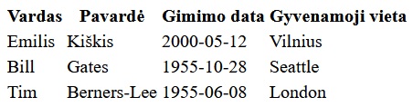

Su CSS galime apipavidalinti šią lentelę, pvz., uždėti kraštines:

### Lentelės kraštinės

```css
table, th, td {
  border: 1px solid black;
}
/* Kas bus, jei neįtrauksime bent vieno iš table, th, td selektoriuje? */
```

Matysime:

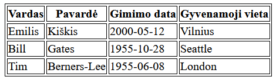

Kraštines galima nustatyti visaip, kaip tik leidžia su `border` susiję atributai, uždėti tik apatines kraštines.

### *border-collapse*

Jei norime atsikratyti dvigubų kraštinių, pridedame `border-collapse: collapse`:

```css
table, th, td {
  border: 1px solid black;
  border-collapse: collapse;
}
```

Matysime:

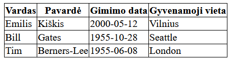

### Langelių sujungimas

Galime sujungti kelis langelius, kad padarytume langelį, kuris užima kelias eilutes ar stulpelius.

Tam padaryti panaudosime `rowspan` ir `colspan` atributus:

* `rowspan` nurodo užimamų eilučių skaičių,
* `colspan` nurodo užimamų stulpelių skaičių.

Šiuos atributus galime pritaikyti `th` ir `td` elementams.

MDN: <https://developer.mozilla.org/en-US/docs/Learn/HTML/Tables/Basics>

## HTML formos

žymės:

- `<form>` - Formos pagrindinis elementas
- `<input>` - įvesties laukas
- `<label>` - input'o paaiškinimas
- `<select>`
- `<option>`
- `<textarea>`
- `<fieldset>`
- `<button>`
- `<output>`

# CSS

## Apie CSS

CSS (Cascading Style Sheets) yra įrankis stilizuoti ir maketuoti žiniatinklio puslapius, pavyzdžiui, norint pakeisti turinio šriftą, spalvą, dydį ir tarpus, suskirstyti jį į kelis stulpelius arba pridėti animacijos ir kitų dekoratyvinių elementų.

Puslapio palyginimas be CSS ir su CSS:

| Be CSS | Su CSS |
| - | - |
|  |  |

## CSS sintaksė
```css
selector {
  attribute: value;
}
```

* selector - "pasirinkėjas", elementų, kuriems bus pritaikomas stilius, aprašymas
* attribute - stiliaus atributas (pvz. `color`, `font-size`)
* value - reikšmė

Pvz.:
```css
p {
  color: blue;
}
```

Vienam stiliaus aprašymui galima priskirti daugiau nei vieną atributą, pavyzdžiui:

```css
p {
  color: blue;
  background-color: aliceblue;
  font-size: 16pt;
}
```

## CSS selektoriai

Paprasčiausi CSS selektoriai:

* `tag` (žymės pavadinimas) - pasirenka visus tos žymės elementus, pvz. `p` pasirinktų visas pastraipas, `img` - visas nuotraukas.
* `.class` (stiliaus klasė) - pasirenka visus elementus, kurie turi klasės atributą su tuo pačiu pavadinimu, pvz. `.melyna` pasirenka visus elementus, kurie turi atributą `class="melyna"`. 
 
  Semantiškai geriausia vadinti klases pagal elementų paskirtį arba stiliaus pobūdį, pvz.:
  * jei turime nuotraukų galeriją, kiekvienai nuotraukai galime priskirti klasę `galerijos-nuotrauka`;
  * jei turime stiliaus aprašymą, kuriuo pakeičiame tekstą į paryškintą ir pabrauktą, galime tą klasę pavadinti `paryskinta`.

* `#id` (identifikatorius) - pasirenka elementą su `id` (identifikatoriaus) atributu. Šio atributo reikšmė yra unikali dokumente, kitaip sakant, vienas identifikatorius gali būti priskirtas tik vienam elementui. Pavyzdžiui, `#logotipas` selektorius pasirinks elementą su atributu `id="logotipas"`.

  Semantiškai ID geriausia vadinti pagal (unikalią) elemento paskirtį, bet ne stiliaus pobūdį. ID geriausia naudoti kaip selektorių tada, kai jau yra priskirtas ID kažkokiam elementui, o tai dažniausiai pasitaiko programuojant su Javascript, kai reikia manipuliuoti konkrečius elementus.

## Paprasti CSS atributai

* `color` - teksto spalva
* `background-color` - fono spalva
* `font-size` - šrifto dydis
* `font-family` - šriftas (pvz. Times New Roman, Arial, Calibri). Rašomas šrifto pavadinimas, jei yra tarpai, pilnas pavadinimas rašomas tarp viengubų `''` arba dvigubų `""` kabučių.
* `text-align` - teksto lygiavimas: `left`, `center`, `right` arba `justify`.
* `width`, `height` - elemento plotis, aukštis, ypač aktualu nuotraukoms (`img` elementams)
* `margin`- elemento paraštės
* `padding` - elemento užpildas (apkamšymas)
* `border` - elemento apvadas. Aprašomas taip: apvado dydis, apvado stilius, spalva. Pvz.: `2px solid blue`

`margin`, `padding` ir `border` papildomai yra `top`, `bottom`, `left` ir `right` atskiri atributai, kurie nustato tik tam tikrą pusę, pvz. `margin-top`, `padding-right`.

Spalvų galimos reikšmės:

  * [Spalvų pavadinimai](https://www.w3schools.com/cssref/css_colors.asp) (pvz. `blue`)
  * Hex išraiška (pvz. `#06b68f`)
  * RGB išraiška (pvz. `rgb(6, 182, 143)`)

Skaičių galimos reikšmės (dydžiams, pvz. `width`, `padding`):

  * Absoliutiniai matavimo vienetai: `px`, `pt`, `cm`
  * Reliatyvūs matavimo vienetai: `%`, `em`, `rem`

    Detalesnis aprašymas apie matavimo vienetus: [https://developer.mozilla.org/en-US/docs/Web/CSS/length](https://developer.mozilla.org/en-US/docs/Web/CSS/length)

## Sudėtingesni CSS selektoriai, naudojant kombinatorius

Pasidarykime pavyzdinę HTML struktūrą:

```html
<main class="turinys">
  <article class="svarbu">
    <h2>Dega Vilnius - KĄTIK ATNAUJINTA (10)</h2>
    <section>
      <h3>Kas nutiko?</h3>
      <p>Id et id excepteur mollit enim reprehenderit eiusmod ipsum tempor magna ad sint adipisicing ipsum.</p>
      <p>Anim laborum in est nisi veniam commodo excepteur proident elit qui deserunt deserunt ad.</p>
    </section>
    <section>
      <h3>Kodėl taip nutiko?</h3>
      <p>Deserunt Lorem esse id nulla in irure elit magna pariatur cillum occaecat tempor.</p>
      <p>Elit eu non culpa aute ea magna. Minim nulla ad exercitation nulla. Reprehenderit est et ipsum culpa nostrud consequat ex adipisicing consectetur nisi.</p>
    </section>
  </article>
  <article>
    <h2>Viskas brangsta</h2>
    <p>Aliquip officia nisi in nisi eiusmod minim excepteur eiusmod ut aute ad labore elit. Aliquip nostrud consequat deserunt esse in eiusmod amet dolore fugiat consequat nulla consectetur id. Est minim sunt elit ea tempor sunt irure culpa anim cillum dolor. Est deserunt aliqua do qui in voluptate in cillum sit. Laborum minim esse esse anim eu consectetur quis ea magna in.</p>
  </article>
  <article>
    <h2>Įžymybė išsiskyrė su kita įžymybe</h2>
    <p>Esse minim ut ut labore eiusmod cillum excepteur. Cillum officia minim sint deserunt.</p>
    <p>Elit officia ea deserunt reprehenderit. Dolor esse veniam minim commodo nulla eiusmod duis ut amet laborum.</p>
    <!-- Nesemantiniai elementai, kuriems suteikiama kodo semantika su CSS klasėmis -->
    <div class="komentarai">
      <div class="komentaras">
        <div class="vardas">Rimas</div>
        <div class="tekstas">Nebemiegu naktimis 😭😭😭</div>
        <div class="ivertinimai">👍200 👎10</div>
      </div>
      <div class="komentaras">
        <div class="vardas">Mantas</div>
        <div class="tekstas">Man tai visiškai neįdomu</div>
        <div class="ivertinimai">👍3 👎87</div>
      </div>
    </div>
  </article>
</main>
<div class="cookies">Naršydami svetainę, sutinkante su slapukų (angl. "cookies") panaudojimu.</div>
```

* `selector1, selector2, ...` - selektorių sąjunga (angl. *selector list*, "selektorių sąrašas"), pvz.:

  ```css
  h1, h2, h3, p {
    color: #333; /* #333 => #333333, #fff => #ffffff ir pan. */
  }
  ```
  Pasirenkami visi `h1`, `h2`, `h3` ir `p` elementai.

  MDN: https://developer.mozilla.org/en-US/docs/Web/CSS/Selector_list

* `selector1 selector2 ...` - hierarchinis kombinatorius (angl. *descendant combinator*, "palikuonio kombinatorius"): pasirenkami elementai pagal `selector2`, kurie yra `selector1` (ne)tiesioginiai vaikai, pvz.:

  ```css
  section p {
    ...
  }
  ```
  Pasirenkami visos pastraipos, kurios yra `section` elementuose, pavyzdžio atveju tik pirmo `article` pastraipos.

  ```css
  article div {
    ...
  }
  ```
  Pasirenkami visi `div` elementai, kurie yra `article` elementuose, pavyzdžio atveju visi `div` elementai paskutiniame `article` elemente.

  Jeigu rašomi keli selektoriai iš eilės, pvz.: `main article.svarbu section h3`, bus pasirenkami elementai pagal paskutinį selektorių, kurie iš eilės seka selektorių hierarchiją.

  MDN: https://developer.mozilla.org/en-US/docs/Web/CSS/Descendant_combinator

* `selector1 > selector2 > ...` - tiesioginio vaiko kombinatorius (angl. *child combinator*, "vaiko kombinatorius") - veikia analogiškai kaip hierarchinis kombinatorius, tačiau šiuo atveju `selector2` privalo būti tiesioginis vaikas `selector1`. Pavyzdžiui, `article > div` pasirinktų tik `<div class="komentarai">` elementą.

  MDN: https://developer.mozilla.org/en-US/docs/Web/CSS/Child_combinator

* `selector1 + selector2 + ...`: sekančio gretimo elemento kombinatorius (angl. *adjacent sibling combinator*, "gretimo brolio/sesers kombinatorius") - juo pasirenkamas tame pačiame lygyje esantis `selector1` selektorių griežtai sekantis elementas, jei jis atitinka `selector2`. Pvz.:

  ```css
  h2 + p {
    ...
  }
  ```

  Šiuo atveju bus pasirenkami `p` elementai, kurie eina iš karto po `h2` elementų, t.y. `Aliquip officia nisi in nisi eiusmod minim excepteur ...` ir `Esse minim ut ut labore eiusmod ...` pastraipos, **tačiau** ne `Elit officia ea deserunt reprehenderit. ...` pastraipa, nes ji nėra gretima `h2` elementui.


  Kitas pavyzdys:
  ```css
  article:first-child + article {
    ...
  }
  ```

  Su šiuo selektoriumi bus pasirinktas tik antras `article` elementas.

  MDN: https://developer.mozilla.org/en-US/docs/Web/CSS/Adjacent_sibling_combinator

* `selector1 ~ selector2 ~ ...` - sekančių elementų selektorius (angl. *general sibling combinator*, "bendro brolio/sesers kombinatorius") - veikia lygiai kaip `+` selektorius, tačiau pasirenka visus sekančius elementus, o ne tik griežtai sekantį. Selektorius `h2 ~ p` pasirinks **ir** `Elit officia ea deserunt reprehenderit. ...` pastraipą ir `article:first-child + article` selektorius pasirinks visus `article` elementus nuo antro.

<p id="css-selektoriai-uzduotys">
Pasibandymui: kokie elementai bus pasirinkti su šiais selektoriais?
</p>

1. `.svarbu p`
2. `.turinys > h2 + p`
3. `article, section > p`

[Atsakymai](#sudėtingesni-css-selektoriai)

## CSS pseudoklasės (*pseudo-classes*)

CSS turi keletą elementų pobūdį apibūdančias klases, pavyzdžiui, kokius ryšius jis turi elementų hierarchijoje arba kokie veiksmai yra atliekami su juo (pasirinkimas, užvedimas su pelyte) ir panašiai. Šios ne su `class` atributu nurodytos klasės yra vadinamos pseudoklasėmis.

Svarbesnių pseudoklasių sąrašas:

* Hierarchinės:
  * `:first-child` - elementas yra tėvinio elemento pirmas vaikas
  * `:last-child` - elementas yra tėvinio elemento paskutinis vaikas
  * `:first-of-type` - elementas yra tėvinio elemento pirmas tokios žymės vaikas
  * `:last-of-type` - elementas yra tėvinio elemento paskutinis tokios žymės vaikas
  * `:nth-child()` - n-tas vaikas, tarp skliaustelių galime įrašyti skaičių pradedant nuo 1, taip pat panaudoti išraiškas su `n`, pvz. `2n`, `3n + 2`, arba parašyti `even` (lyginis) arba `odd` (nelyginis).
  * `:nth-last-child()` - taip pat kaip `:nth-child()`, tik skaičiuojama nuo galo.
  * `:nth-of-type()` - taip pat kaip `:nth-child()`, tačiau pasirenkami elementai pagal žymės panaudojimo pasikartojimą, kaip su `:first-of-type`/`:last-of-type` pseudoklasėmis.
  * `:nth-last-of-type()` - kaip `:nth-of-type()`, tik skaičiuojama nuo galo.
* Būsenos:
  * `:hover` - kai pelytė užvesta virš elemento
  * `:focus` - kai elementas yra pasirinktas (sufokusuotas), pvz. pasirinktas įvedimo laukas
  * `:active` - kai elementas yra spaudžiamas, pvz. spaudžiama nuoroda ar mygtukas
  * `:link` - kai nuoroda yra neaplankyta (naršyklės istorijoje nėra įrašo)
  * `:visited` - kai nuoroda yra aplankyta
  * `:target` - kai į elementą buvo nueita paspaudus nuorodą (nuoroda baigiasi kokiu nors id (pvz. `#main`) ir elementas turi atitinkamą `id` atributą (pvz. `id="main"`)
* Įvesties laukų (`<input>`):
  * `:autofill` - laukas buvo užpildytas automatiškai, pasinaudojant naršyklės automatinio užpildymo įrankiu
  * `:disabled` - laukas yra neaktyvus (turi atributą `disabled=""`)
  * `:read-only` - lauko turinys neredaguojamas (turi atributą `readonly=""`)
  * `:checked` - `<input type="radio">` arbar `<input type="checkbox">` įvedimo laukas yra pažymėtas
  * `:invalid` - lauke įvesta informacija yra nevalidi, pvz. `<input required="">` yra tuščias.
  * `:required` - laukas yra privalomas (turi `required=""` atributą)

Pseudoklases galima naudoti kaip paprastas klases rašydami selektorius, tokius kaip `:first-child`, `button:hover`, `input:required:invalid`.

Pilnas sąrašas: https://developer.mozilla.org/en-US/docs/Web/CSS/Pseudo-classes

## Flexbox

Flexbox yra įrankis patogiai išdėlioti bet kokio dydžio elementus įvairiomis kryptimis. Kadangi aprašyti veikimo principus užtruktų labai ilgai ir reikalauja demonstracijų, čia aprašysiu tik CSS atributus.

Paskaitų įrašai: [Pirma](https://codeacademylt.sharepoint.com/:v:/r/sites/VIGI28Kaunas/Shared%20Documents/General/Recordings/Meeting%20in%20_General_-20220420_180005-Meeting%20Recording.mp4?csf=1&web=1&e=oBdJqb) [Antra](https://codeacademylt.sharepoint.com/:v:/r/sites/VIGI28Kaunas/Shared%20Documents/General/Recordings/Meeting%20in%20_General_-20220421_180219-Meeting%20Recording.mp4?csf=1&web=1&e=N2qWFC)

Pagrindinė Flexbox HTML struktūra:

```html
<div class="container">
  <div class="item">...</div>
  <div class="item">...</div>
  <div class="item">...</div>
  <div class="item">...</div>
</div>
```

Naudoti `div` ar klasių nebūtina, tačiau visa esmė - Flexbox'e yra flex containeris ir flex itemai. Flex containeris talpina flex itemus ir juos sudeda pagal jų dydžius, o flex itemams galime nurodyti, kaip jie elgiasi flex containeryje.

Nurodytai HTML struktūrai turėtume pritaikyti minimalų CSS:

```css
.container {
  display: flex;
  /* arba */
  display: inline-flex;
  /*
    Vienintelis skirtumas - flex yra blokinis elementas,
    o inline-flex yra įterptinis (inline) elementas
  */
}
```

Atributai, kuriuos galima priskirti `display: flex`/`inline-flex` elementui:

* `flex-direction` - elementų dėliojimo kryptis.
  
  Galimos reikšmės:
  
  * `row` (numatytoji) - dėlioja elementus iš kairės į dešinę
  * `column` - dėlioja elementus iš viršaus į apačią
  * `row-reverse` - dėlioja elementus iš dešinės į kairę
  * `column-reverse` - dėlioja elementus iš apačios į viršų
  
* `flex-wrap` - nurodo, ar elementai, netelpantys į containerio plotį ar aukštį pagal dėliojimo kryptį, yra perkeliami į naują eilutę ar stulpelį.

  Galimos reikšmės:

  * `nowrap` (numatytoji) - elementai nebus perkeliami
  * `wrap` - elementai bus perkeliami
  * `wrap-reverse` - elementai bus perkeliami į priešingą kryptį normaliam išdėstymui - jei `flex-direction: row`, tai naujos eilutės bus aukščiau, jei `flex-direction: column`, bus kairiau.
  
* `flex-flow` - leidžia nurodyti `flex-direction` ir `flex-wrap` atributus kartu.
  
  Aprašymo būdas: `flex-flow: <flex-direction> <flex-wrap>`, tarp `<>` įrašomos tiems atributams galimos reikšmės.
* `justify-content` - sulygiuoja elementus pagrindinėje flex containerio ašyje (horizontaliai jei `row`, vertikaliai jei `column`)

  Galimos reikšmės:

  * `flex-start` (numatytoji) - elementai prišliejimi prie flex containerio pradžios (ji yra priešingoje pusėje, jei darome `row-reverse` arba `column-reverse`)
  * `flex-end` - elementai prišliejami prie flex containerio pabaigos
  * `center` - elementai sulygiuojami per vidurį
  * `space-between` - elementai prišliejami prie abiejų pusių, neužpildyta containerio vieta tolygiai paskirstoma tarp elementų
  * `space-evenly` - kaip `space-between`, bet tarpai pridedami iš kairės pusės pirmam elementui bei iš dešinės pusės dešiniam elementui
  * `space-around` - kaip `space-evenly`, bet kraštinių elementui tarpas nuo krašto yra perpus mažesnis (susidaro įprasto dydžio tarpas, jei įsivaizduojame containerio elementus išdėstytus apskritimu, kur pradžia ir pabaiga susijungia)

* `align-items` - sulygiuoja kiekvienos eilutės ar stulpelio elementus antrinėje ašyje (vertikaliai jei `row`, horizontaliai jei `column`)

  Galimos reikšmės:
  * `flex-start` - elementai prišliejimi prie antrinės ašies pradžios (ji yra priešingoje pusėje, jei darome `row-reverse` arba `column-reverse`) - viršuje jei `row`, kairėje jei `column`
  * `flex-end` - elementai prišliejami prie antrinės ašies pabaigos - apačioje jei `row`, dešinėje jei `column`
  * `center` - elementai sulygiuojami per vidurį
  * `stretch` (numatytoji) - išdidina vidinių elementų aukščius, kad pilnai užpildytų visą eilutę ar stulpelį.
  
* `align-content` - sulygiuoja visas eilutes ar stulpelius visame flex containeryje

  Galimos reikšmės tokios kaip su `align-items`, tačiau jos lygiuoja visus flexbox eilutes/stulpelius, o ne pavienius elementus, ir galimos trys papildomos:

  * `space-between`
  * `space-evenly`
  * `space-around`

  Visos veikia kaip ir su `justify-content` atributu, tik kitoje ašyje.

Atributai, kuriuos galima priskirti flex itemams:

* `flex-grow` - padidina elemento dydį tiek, kad užpildytų likusią containerio vietą. Nurodyta reikšmė parodo, kokia dalis laisvos vietos atitenka santykinai su kitais elementais (pagrindinė demonstracija paskaitos įraše)

  Be `.item:first-child { flex-grow: 1 }`:

  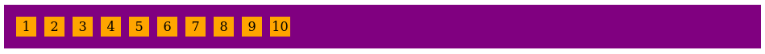

  Su `.item:first-child { flex-grow: 1 }`:

  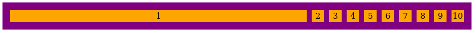

  Be `.item { flex-grow: 1 }`:'

  

  Su `.item { flex-grow: 1 }`:

  
  
* `flex-shrink` - veikia panašiai kaip `flex-grow`, bet atvirkščiai - vietą, kurioje elementai išėjo už containerio ribų, susigrąžina sumažinant tam tikrus flex elementus. Nurodyta reikšmė parodo, kiek bus sumažintas elementas santykinai su kitais elementais.

  Kaip suskaičiuoti, kiek sumažėja elementas:

  * Containerio plotis - *c_width*
  * Elementų pilni pločiai (su paddingais ir t.t.) - *el_width1*, *el_width2*, ...
  * Santykių suma - *count*

  Vieno santykinio vieneto dydis gaunamas iš visų elementų pločių atėmus containerio plotį ir tada padalinus iš santykių sumos:

  `(el_width1 + el_width2 + ... - c_width) / count`

  Pvz.:

  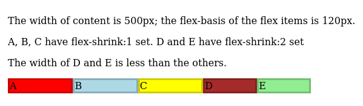
  
  Containerio plotis 500px, 5 elementai su `flex-basis: 120px` ir `border: 3px` (galutinis plotis po 126px), ir pirmiems trims elementams pritaikom `flex-shrink: 1;`, kitiems dviems `flex-shrink: 2;`, gauname:

  `(126px * 5 - 500px) / 7 ≈ 18,57px`

  Elementai su `flex-shrink: 1;` sumažėja po 18,57px, su `flex-shrink: 2;` sumažėja po 37,14px.

* `flex-basis` - nurodo pradinį flex itemo dydį (plotį arba aukštį), prieš pritaikant `flex-grow` ir `flex-shrink` atributus. Įprastai, tai yra tiesiog `width` arba `height` reikšmė.
* `flex` - sudėtingas atributas, kuriam galima priskirti daug įvairių reikšmių (plačiau apie tai MDN), tačiau paprasčiausias panaudojimas - priskirti skaitinę reikšmę (0, 1, 2, ...), tokiu atveju jis nustato tris atributus vienu metu:

  ```css
  flex-grow: nurodyta skaitinė reikšmė;
  flex-shrink: 0;
  flex-basis: 0%; /* Svarbu - nurodo, kad elementas neturi pradinio dydžio */
  ```

  Be `.item:first-child { flex: 1 }`:

  

  Su `.item:first-child { flex: 1 }`:

  

  Be `.item { flex: 1 }`:'

  

  Su `.item { flex: 1 }`:

  

* `align-self` - sulygiuoja itemą vienoje eilutėje/stulpelyje pagal antrinę ašį. Galimos reikšmės tokios pačios, kaip `align-items`.
* `order` - nurodo elemento padėtį eilėje. Pagal nutylėjimą reikšmė 0 ir flex containeris surikiuoja elementus pagal `order` nuo mažiausio iki didžiausio, o jeigu kelių elementų `order` sutampa - pagal HTML struktūrą.
  
  Pavyzdžiui, nurodžius tam tikram elementui `order: -1;`, jis bus padedamas į eilės priekį, o `order: 1;` - į galą.

Flex itemai taip pat gali būti ir flex containeriai, jei jiems pritaikomas `display: flex`/`inline-flex` atributas. Veikimo principas paprastas - kaip itemai, jie užima kažkiek vietos tėviniame containeryje, o kaip containeriai, savo vaikinius elementus išdėsto pagal Flexbox.

MDN: <https://developer.mozilla.org/en-US/docs/Learn/CSS/CSS_layout/Flexbox>

## Grid

[Paskaitos įrašas](https://codeacademylt.sharepoint.com/:v:/r/sites/VIGI28Kaunas/Shared%20Documents/General/Recordings/General-20220425_180115-Meeting%20Recording.mp4?csf=1&web=1&e=bjBgmM)

MDN: <https://developer.mozilla.org/en-US/docs/Web/CSS/CSS_Grid_Layout>

## Prisitaikantys puslapiai (*responsive websites*) naudojant @media

Kad tas pats HTML turinys būtų rodomas skirtingu išdėstymu skirtinguose ekranuose, galime rašyti CSS media užklausas (*media queries*), kad tam tikri stiliai būtų pritaikyti tam tikroje situacijoje, dažniausiai pagal ekrano dydį (plotį).

Sintaksė nesudėtinga:

```css
@media (attribute: value) {

}
```

Parašę `@media`, galime patikrinti, ar tam tikras aplinkos kintamasis (pvz. ekrano plotis, aukštis, kryptis) atitinka reikšmę. Sakykime, jei norime pritaikyti stilius, jei ekrano plotis yra bent 800 pikselių, rašytume `@media (min-width: 800px)`, pvz.:

```css
/* Įprastas CSS */
.container {

}
...

/* Media užklausa pirmame lygmenyje */
@media (min-width: 800px) {
  /* Rašome stilius viduje */
  .container {
    ...
  }
  .container > .item {
    ...
  }
}
```

Jeigu norime sujungti kelias sąlygas į vieną `@media` užklausą, sujungiame jas su žodeliu `and`. Pavyzdžiui, patikrinti, ar ekranas yra tarp `800px` ir `1200px`, rašytume taip:

```css
@media (min-width: 800px) and (max-width: 1200px) {

}
```

Auga "Media Queries Level 4" specifikacijos palaikymas, kur galime nurodyti palyginimo ženklus sąlygose, pvz.:

```css
/* Aukštis daugiau nei 600px */
@media (height > 600px) {
  body { line-height: 1.4; }
}

/* Plotis tarp 400px ir 700px */
@media (400px <= width <= 700px) {
  body { line-height: 1.4; }
}
```

MDN: <https://developer.mozilla.org/en-US/docs/Web/CSS/@media>

## "Mobile-first" dizainas

Didžioji dalis interneto vartotojų šiais laikais naudojasi mobiliais įrenginiais su mažu ekranu[^1], taigi norint pasiekti didžiausią vartotojų rinką, protingiausia yra pagrindinį puslapio vaizdą pritaikyti telefonui, o tik antrinį staliniam kompiuteriui (desktop'ui).

Pagrinde tai yra dizaino sprendimai, tačiau rašant CSS kodą šiek tiek pasikeičia jo rašymo tvarka - vietoj to, kad pirmiausiai rašytume desktop CSS, o paskui su `@media` užklausomis pritaikytume prie mobile, pirmiausia rašome mobile CSS, o paskui pritaikome prie desktop.

Nedidelis pavyzdys:

Desktop first:
```css
html { background: red; }

@media (max-width: 600px) {
  html { background: green; }
}
```

Mobile first:

```css
html { background: red; }

@media (min-width: 600px) {
  html { background: green; }
}
```

Tačiau svarbiausia yra ne kodo rašymo tvarka, o kodo trumpinimas prioritizuojant dizainą mobiliems įrenginiams ir nedaug pakeičiant jį pritaikyti jį dideliems ekranams. Pavyzdžiui, Bootstrap karkasas yra iš esmės padarytas *mobile-first*:

> **Mobile first, responsive design is the goal.** Bootstrap’s CSS aims to apply the bare minimum of styles to make a layout work at the smallest breakpoint, and then layers on styles to adjust that design for larger devices. This optimizes your CSS, improves rendering time, and provides a great experience for your visitors.
> 
> (<https://getbootstrap.com/docs/5.1/layout/breakpoints/#core-concepts>)

[^1]: Kol kas neturiu šaltinio

## CSS karkasai (*frameworks*)

CSS karkasai leidžia kurti gražiai atrodančius puslapius panaudojant kitų žmonių parašytus CSS stilius, pritaikant juos savo puslapiui.

Keli CSS (kartais su JS) karkasų pavyzdžiai:

* Bootstrap <https://getbootstrap.com/> (bene populiariausias)
* Bulma <https://bulma.io/>
* Material Design <https://material.io/>

Išsamesnis sąrašas: <https://github.com/troxler/awesome-css-frameworks>

Mūsų atveju, prieš pradedant dirbti su JS, lengviausia įsirašyti šiuos karkasus įterpiant nurodytas `<link>` žymes į CDN (Content Delivery Network) nuorodas, pvz.:

```html
<!-- Bulma -->
<link rel="stylesheet" href="https://cdn.jsdelivr.net/npm/bulma@0.9.3/css/bulma.min.css">

<!-- Bootstrap -->
<link href="https://cdn.jsdelivr.net/npm/bootstrap@5.1.3/dist/css/bootstrap.min.css" rel="stylesheet" integrity="sha384-1BmE4kWBq78iYhFldvKuhfTAU6auU8tT94WrHftjDbrCEXSU1oBoqyl2QvZ6jIW3" crossorigin="anonymous">
<script src="https://cdn.jsdelivr.net/npm/bootstrap@5.1.3/dist/js/bootstrap.bundle.min.js" integrity="sha384-ka7Sk0Gln4gmtz2MlQnikT1wXgYsOg+OMhuP+IlRH9sENBO0LRn5q+8nbTov4+1p" crossorigin="anonymous"></script>

<!-- Material Design neįrašomas naudojant CDN -->
```

## CSS preprocesoriai (*preprocessors*)

CSS preprocesoriai leidžia rašyti CSS kodą su papildomu funkcionalumu, kuris paskui yra paverčiamas į standartinį CSS kodą.

Du populiariausi CSS preprocesoriai yra:

* Sass (<https://sass-lang.com/>) - suteikia daug funkcionalumo, tačiau sunkiau išmokstamas
* Less (<https://lesscss.org/>) - suteikia kiek mažiau funkcionalumo, tačiau veikia greitai ir yra nesudėtingas.

Programuojant VS Code, patarčiau naudoti šiuos įrankius:

  * Su Sass - Sass plėtinys ([syler.sass-indented](https://marketplace.visualstudio.com/items?itemName=Syler.sass-indented)) ir `sass` terminalo programa (įsirašome su `npm i -g sass`)
  * Su Less - Easy LESS plėtinys ([mrcrowl.easy-less](https://marketplace.visualstudio.com/items?itemName=mrcrowl.easy-less))


Įsirašyti `npm` galima iš <https://nodejs.org/en/> puslapio su installeriu per Windows arba naudojant Homebrew (`brew`) Mac'e.

Keli papildomų galimybių pavyzdžiai, kurie yra abiejuose (ir dažniausiai kituose) preprocesoriuose:

* Nesting (selektorių dėjimas vienas į kitą)

  ```less
  selector1 {
    color: white;
    selector2 {
      color: blue;
    }
  }
  ```

  pavirsta

  ```less
  selector1 {
    color: white;
  }
  selector1 selector2 {
    color: blue;
  }
  ```

  Tokioje hierarchijoje galima išreikšti bet kokį įprastą ryšį kaip ir paprastame CSS'e, pvz.:

  - `selector1 > selector2` -> `selector1 { > selector2 }`
  - `selector1 + selector2` -> `selector1 { + selector2 }`

  ir t.t.

  Jeigu norime parašyti papildomą išraišką, kuri yra hierarchiškai tame pačiame lygmenyje, pvz. turėti `.container .item:not(:first-child)`, galima panaudoti `&` simbolį, kad išreikšti esamą selektorių:

  ```less
  .container {
    display: flex;
    > .item {
      flex: 1;
      &:not(:first-child) {
        margin-left: 10px;
      }
    }
  }
  ```

  pavirsta

  ```less
  .container {
    display: flex;
  }
  .container > .item {
    flex: 1;
  }
  .container > .item:not(:first-child) {
    margin-left: 10px;
  }
  ```

* Kintamieji

  Su kintamaisiais galime lengvai perpanaudoti besikartojančias reikšmes, pvz. puslapio paletės spalvas, tarpus tarp elementų ir pan.

  Pavyzdys (su Less sintakse):

  ```less
  @primary: rgb(29, 54, 93);
  @white: #eee;
  @black: #333;
  @gap: 10px;

  .container {
    background-color: @white;
    > .item {
      color: @primary;

      &:not(:first-child) {
        margin-left: @gap;
      }
    }
  }
  ```

  pavirsta

  ```less
  .container {
    background-color: #eee;
  }
  .container > .item {
    color: rgb(29, 54, 93);
  }
  .container > .item:not(:first-child) {
    margin-left: 10px;
  }
  ```

* *Mixins*

  *Mixins* galime panaudoti, kad perpanaudotume CSS kodą kartu su atributais. Principas *mixin* yra kodo įterpimas, perpanaudojimas kitoje vietoje.

  Pavyzdys (Less sintakse):

  ```less
  .flexCenter() {
    display: flex;
    align-items: center;
    justify-content: center;
  }

  .container {
    .flexCenter();

    > .item {
      .flexCenter();
    }
  }
  ```

  pavirsta

  ```less
  .container {
    display: flex;
    align-items: center;
    justify-content: center;
  }

  .container > .item {
    display: flex;
    align-items: center;
    justify-content: center;
  }
  ```

Naudojant CSS preprocesorius kartu su karkasais (*frameworks*), galima lengvai pakeisti nemažą dalį karkaso funkcionalumo. Pavyzdžiui, Bulma CSS karkasas leidžia pakeisti paletės spalvas ar kitus kintamuosius su Sass iš pradžių nurodant keičiamų kintamųjų reikšmes, o paskui įtraukiant Bulma:

```scss
$primary: rgb(29, 54, 93);
$white: #eee;
$black: #333;
$gap: 10px;

@import('/path/to/bulma/bulma.scss');
```

MDN: <https://developer.mozilla.org/en-US/docs/Glossary/CSS_preprocessor>

## Git + Github

Naudodami Git, galime lengvai sekti kodo pakeitimus ir jais pasidalinti su kitais žmonėmis.

Git atsisiunčiame iš <https://git-scm.com/>, įsidiegiame su numatytais nustatymais, išskyrus pakeičiame numatytąjį teksto redaktorių iš Vim į Visual Studio Code (nebent norite išmokti naudotis Vim):

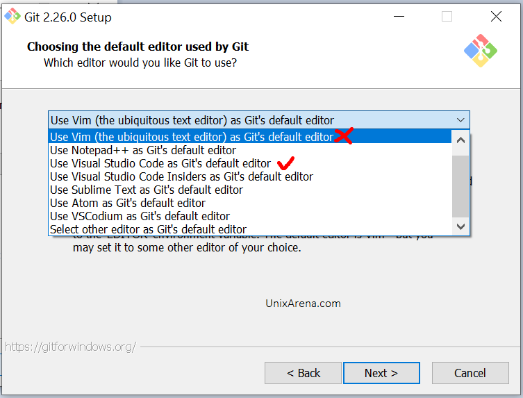

Įsirašę Git, turime du pasirinkimus: naudotis terminalo programa `git` arba Visual Studio Code įrankiu Source Control 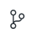

Kaip pasiruošti naudoti Git - terminale įvykdykite šias komandas, teisingai užpildydami informaciją:

```sh
git config --global user.name "Vardas Pavardė"
git config --global user.email "vardas.pavarde@pastas.lt" 
```

Pavyzdžiui:

```sh
git config --global user.name "Emilis Kiškis"
git config --global user.email "emilis.kiskis@codeacademylt.onmicrosoft.com"
```

Norėdami naujame projekte sukurti repozitoriją, tinkamame kataloge parašome komandą `git init` arba paspaudžiame "Initialize Repository":


Išsaugoti pakeitimus - pirmiausiai pažymime norimus išsaugoti pakeitimus:

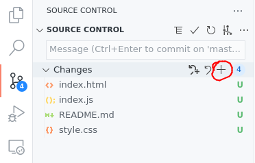

Po to įrašome *commit* pranešimą ir paspaudžiame <kbd>Ctrl+Enter</kbd>:

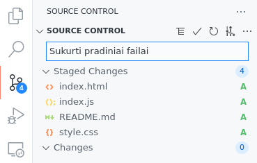

Tada įkelti pakeitimus į GitHub galime iš eilės paspaudę "Publish Branch" ir pasirinkdami, ar sukursime viešą, ar privačią repozitoriją:

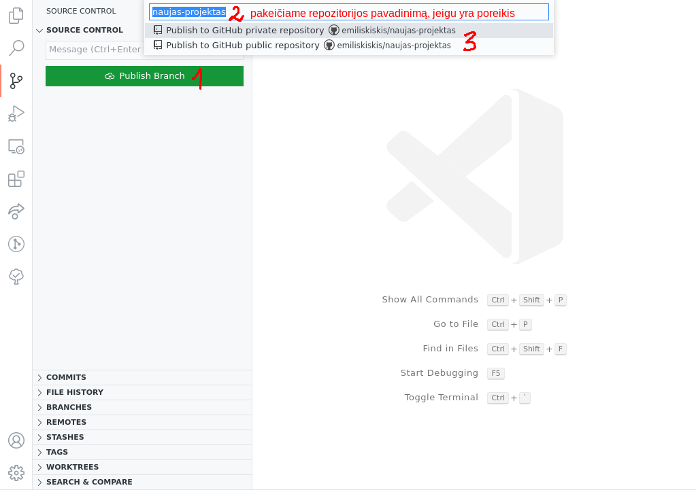

Tolimesnius pakeitimus įkelti ar atsisiųsti naudosime "Sync Changes" mygtuką:

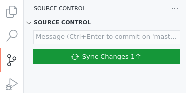

Analogiškai galime šiuos veiksmus atlikti terminale:

```sh
git init
git add . # . nurodo, kad pridedame viso esamo katalogo pakeitimus
git commit -m "Pakeitimo pranešimas"

# Darbui su GitHub
# Pirmiausia susikuriame repozitoriją GitHub svetainėje, toliau rašome:
git remote add origin https://github.com/vartotojas/repozitorija.git
  # Patogiai nuorodą galite gauti paspaudę žalią "Code" mygtuką GitHube
git push -u origin master # pirmą kartą
git push # tolimesni įkėlimai
git pull # atsisiųsti pakeitimus iš GitHub
```

Jeigu repozitorijos neturime kompiuteryje, bet ji yra GitHub, paspaudžiame "Clone Repository" mygtuką:

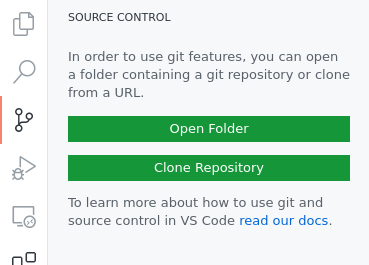

Viršuje pasirenkame "Clone from GitHub":

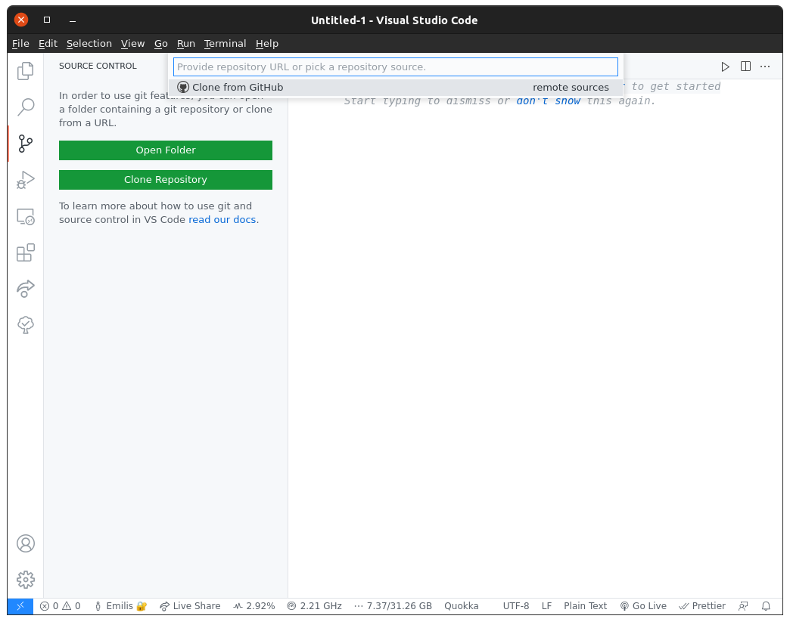

Pasirenkame norimą atsisiųsti repozitoriją:

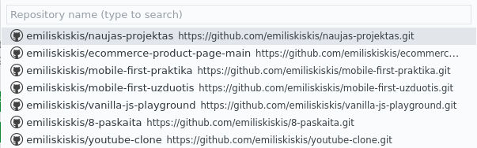

Pasirenkame "Open", kad atsidarytume atsisiųstą repozitoriją:

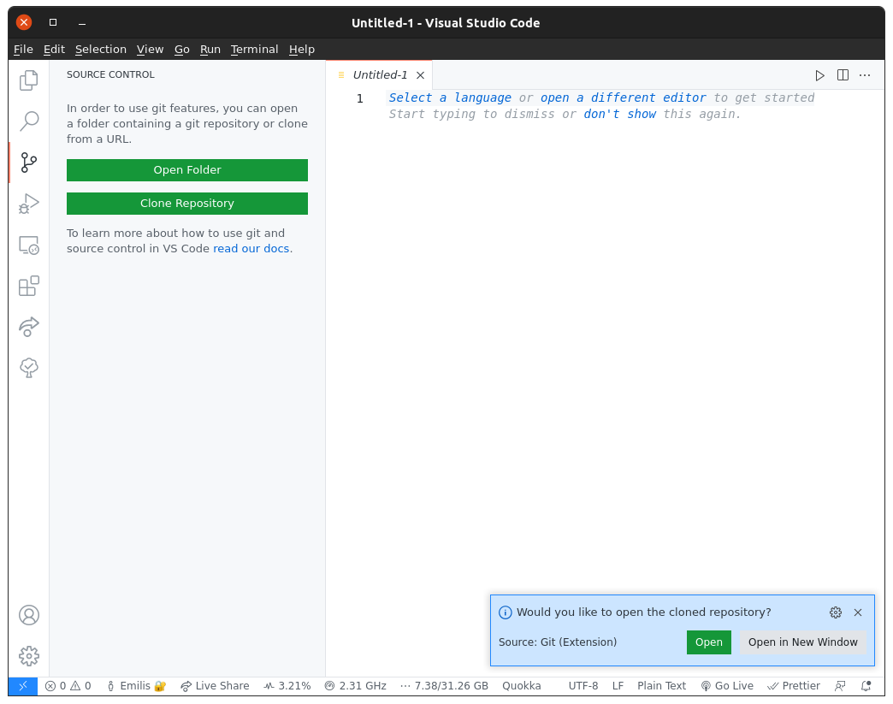

Turime atsisiųstą repozitoriją, kurioje galime atlikti visus Git veiksmus.

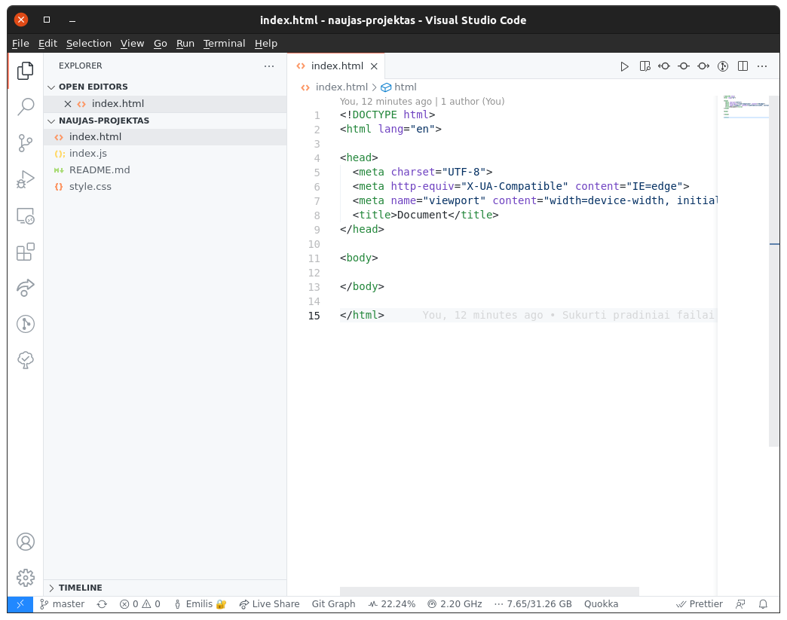

Terminale šie veiksmai būtų atliekami taip:

Atsidarome repozitoriją GitHub:

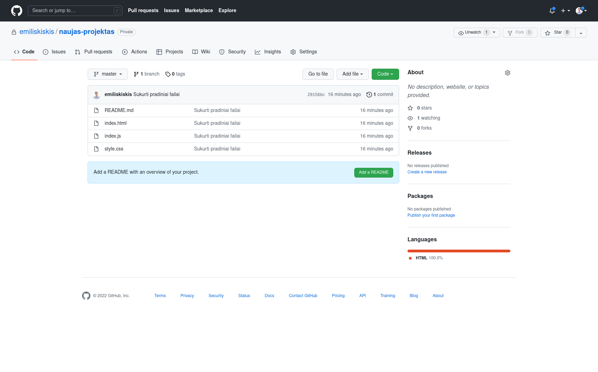

Paspaudžiame "Code" mygtuką ir nusikopijuojame nuorodą:

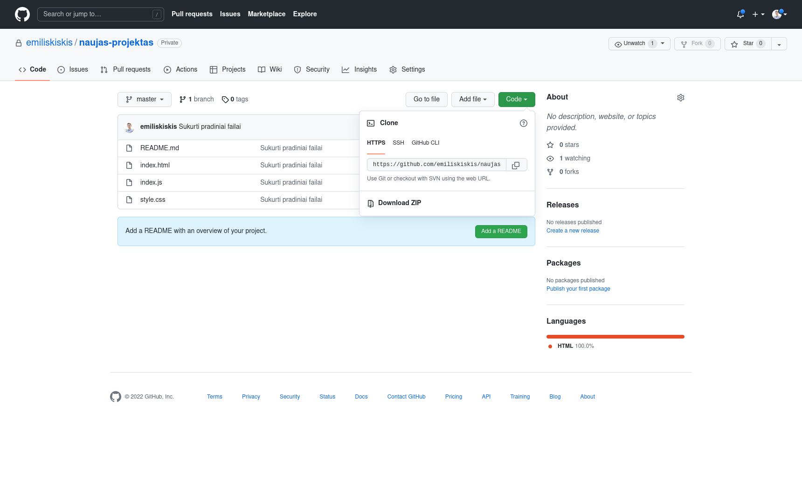

Teisingame kataloge terminale parašome šią komandą, pradedant nuo `git clone` (pakeiskite nuorodą savąją):

```sh
# Mac terminalas / Powershell
emilis@emilis-PC:~/Desktop/CodeAcademy$ git clone https://github.com/emiliskiskis/naujas-projektas.git

# Windows komandinė eilutė
C:/Users/emilis/Desktop/CodeAcademy> git clone https://github.com/emiliskiskis/naujas-projektas.git
```

Repozitorija bus atsiųsta į terminale nurodytą kelią (pvz. C:/Users/emilis/Desktop/CodeAcademy) kataloge "naujas-projektas".

# Atsakymai į praktikos užduotis

## Sudėtingesni CSS selektoriai

[Atgal į užduotis](#css-selektoriai-uzduotys)

1. `.svarbu p` - 4 pastraipos:

  ```html
  <p>Id et id excepteur mollit enim reprehenderit eiusmod ipsum tempor magna ad sint adipisicing ipsum.</p>
  <p>Anim laborum in est nisi veniam commodo excepteur proident elit qui deserunt deserunt ad.</p>
  <p>Deserunt Lorem esse id nulla in irure elit magna pariatur cillum occaecat tempor.</p>
  <p>Elit eu non culpa aute ea magna. Minim nulla ad exercitation nulla. Reprehenderit est et ipsum culpa nostrud consequat ex adipisicing consectetur nisi.</p>
  ```

2. `.turinys > h2 + p` - niekas, nes nėra nė vieno `h2` elemento, kuris būtų tiesioginis `<main class="turinys">` elemento vaikas.
3. `section, article > p` - visi `section` elementai bei šios pastraipos:

  ```html
  <p>Aliquip officia nisi in nisi eiusmod minim excepteur eiusmod ut aute ad labore elit. Aliquip nostrud consequat deserunt esse in eiusmod amet dolore fugiat consequat nulla consectetur id. Est minim sunt elit ea tempor sunt irure culpa anim cillum dolor. Est deserunt aliqua do qui in voluptate in cillum sit. Laborum minim esse esse anim eu consectetur quis ea magna in.</p>
  <p>Esse minim ut ut labore eiusmod cillum excepteur. Cillum officia minim sint deserunt.</p>
  <p>Elit officia ea deserunt reprehenderit. Dolor esse veniam minim commodo nulla eiusmod duis ut amet laborum.</p>
  ```

Planavau padaryti daugiau užduočių, tačiau neturėjau daug laiko ir teko atidėti šią užduotį kitam kartui.
